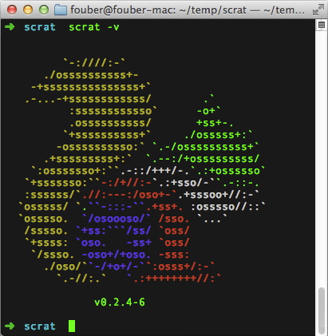

## scrat官网项目

地址：http://scrat-team.github.io/

travis-ci：

## 文档

* [快速开始](components/pages/quick-start/doc.md)
* [模块开发](components/pages/modular/doc.md)
* [前端框架](components/pages/framework/doc.md)
* [模块生态](components/pages/components/doc.md)
* [工具命令](components/pages/command/doc.md)
* [工具配置](components/pages/settings/doc.md)
* [项目实战](components/pages/practice/doc.md)
* [幕后花絮](https://github.com/fouber/blog/issues/2)