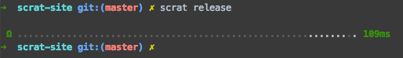
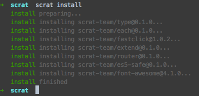

> scrat是基于 [fis](http://fis.baidu.com) 打造的集成解决方案，其命令行风格也基本保持一致。

## scrat release

> 项目构建命令，满足所有开发、构建、部署需求。

在项目目录下执行 ``scrat release`` 命令，即可对项目进行构建，并将构建结果发布到本地服务器调试目录



构建工具常见的功能就是区分构建目的，比如开发构建、测试构建、上线构建等。scrat并不像 [grunt](http://gruntjs.com) 或者 [gulp](http://gulpjs.com) 那样定义不同的task来区分构建目的，而是通过release命令的多种参数组合来确定构建目的。

scrat release 命令的所有参数可以通过 scrat release -h 命令来查看，其中常用的包括：

* ``--dest <paths>``：指定构建结果的发布路径。
* ``--md5``：是否给非模块化静态资源添加md5戳。
* ``--domains``：是否为静态资源添加域名。
* ``--lint``：是否开启代码校验。
* ``--optimize``：是否开启代码压缩
* ``--pack``：是否开启csssprite、combo合并。
* ``--watch``：是开启文件监听
* ``--live``：是否开启浏览器自动刷新
* ``--unique``：是否使用独立缓存(ci上构建时使用)

scrat release 命令的所有参加均可 ``自由组合``，不同参数的不同组合即可得到不同的开发状态，参数顺序没有影响。

## 工作方式


scrat ``绝对不会`` 修改用户的源代码，而是将源码处理后发布到另外一个目录下，这样可以对产出目录中的文件进行浏览或发布。因此scrat release其实始终需要 ``--dest <发布目录>``参数来制定发布目的地的。开发时为了方便起见，运行省略--dest参数，如果省略，代码会被发布到内置的调试服务器目录下，方便预览。

> 有些简易的构建工具会对源码直接进行浏览，其原理是服务器浏览的同时实时构建代码，这种方式``很矬``，相当于写了两套构建过程，非常不可取。

### 本地开发

> 无压缩优化 + 文件监听 + 自动刷新

本地开发常用的参数组合就是 ``--watch`` 和 ``--live`` 了，也就是文件监听+浏览器自动刷新：

```bash
scrat release --watch --live
```

添加--watch参数之后，命令行会hold住，保持命令窗口不要关闭，执行修改源码、保持，就能看到浏览器自动刷新。

--watch 和 --live 参数都有各自的缩短写法 ``-w`` 和 ``-L``(注意大小写)。因此上面的命令可以简写为：

```bash
scrat release -w -L
```

另外，命令行参数还能进一步 ``连写`` ，因此上述命令还能进一步简化为：

```bash
scrat release -wL
```

由于命令省略了 ``--dest <paths>`` 参数，因此scrat会把构建结果发送到默认的服务器目录，使用 ``scrat server open`` 命令可以查看该目录。

### 上线部署

> 加域名 + 压缩 + 校验 + 加md5戳 + 请求合并&CSS雪碧图 + 发布到指定目录。

要上线部署时，就不在需要文件监听(--watch)和自动刷新(--live)了，此时使用 ``--dest <paths>`` 参数把处理后的代码发布到指定目录，然后将发布目录下的代码部署到线上即可，在项目目录下执行：

```bash
scrat release --domains --optimzie --lint --md5 --packe --dest ../output
```

同样的，可以使用简写和连写的方式：

```bash
scrat release -Dolmpd ../output
```

将代码发布到指定目录后就可以做进一步的部署安排了，scrat [官网项目](https://github.com/scrat-team/scrat-site/) 就是用scrat进行 [持续集成构建](https://travis-ci.org/scrat-team/scrat-site) 的，代码构建好之后又做了一系列的 [部署操作](https://github.com/scrat-team/scrat-site/blob/master/.build.sh)，最终将构建结果推送到github.io上。

## scrat install

> 从GitHub安装生态组件，提升开发效率。

scrat采用 [component](https://github.com/component) 作为模块生态，有关模块生态的更多信息请阅读 [这里](/#!/components)。

在项目目录下准备一个 ``component.json`` 文件，用于记录生态模块安装信息。如果component.json中已声明了依赖，直接执行：

```bash
scrat install
```

即可将依赖的生态模块直接从Github下载下来并安装到工程中：



当项目未获到一定阶段后，需要安装新的模块，直接运行：

```bash
scrat install <用户名>/<仓库名>
```

其中的用户名为GitHub用户名，如果需要安装指定版本的模块，则执行：

```bash
scrat install <用户名>/<仓库名>@版本号
```

例如想安装最新版的 [fastclick](https://github.com/ftlabs/fastclick)，其拥有者为 [ftlabs](https://github.com/ftlabs)，则在项目目录下执行：

```bash
scrat install ftlabs/fastclick
```

如果要安装 ``v0.6.5`` 这个版本，则执行：

```bash
scrat install ftlabs/fastclick@v0.6.5
```

## scrat server &lt;cmd&gt;

> nodejs服务器相关命令，方便本地浏览调试项目。

scrat设计之初是考虑和nodejs服务器进行结合的项目开发，因此内置的调试服务器也是来自工程的源代码支持。scrat server有三条服务器相关的命令，分别是：

### scrat server open

> 打开调试服务器目录

``scrat release`` 命令默认的发布路径极为该目录。项目开发时，执行 scrat release 命令，工具会把工程构建之后发布到这个目录下。不同的操作系统其调试服务器目录也不同，其中：

* mac：/Users/&lt;用户名&gt;/.scrat-tmp/www
* linux：/home/&lt;用户名&gt;/.scrat-tmp/www
* windows：C:\\Documents and Settings\\&lt;用户名&gt;\Application Data\\.scrat-tmp\\www

调试目录是一个 ``垃圾堆``，把项目构建过去浏览即可。

### scrat server start

> 启动调试服务器

在启动调试服务器之前，先对项目进行一次构建，执行 ``scrat release``，工具把构建后的代码发布到调试目录中，此时在 ``任意位置`` 执行：

```bash
scrat server start
```

命令会去到 ``调试目录`` 中执行 ``npm install && node .`` 命令。这样，如果源码工程中有 ``package.json`` 文件，经过scrat release命令的构建，就会发布到调试目录下，之后再在调试目录下执行 ``npm install && node .`` 即可根据package.json的记录安装npm包并执行package.json所指定的main文件了。

### scrat server clean

> 清除调试目录下的文件

有时候本地开发可能会在多个项目中切换，由于scrat构建时，默认的代码都发布到相同的调试目录下，因此切换项目前应该先进行清除调试目录文件的操作。在任意位置执行：

```bash
scrat server clean
```

即可清除调试目录下的文件，得到一个干净的调试环境。

## scrat init

> 项目脚手架，快速创建新项目。

执行一下，你就知道，这里就不赘述了。

## 用 ``-h`` 参数获取帮助

所有命令的基本用法及参数说明均可以通过 ``-h`` 参数获取。比如想查看scrat有哪些内置命令，则执行：

```bash
scrat -h
```

即可查看所有scrat内置的命令：

```bash
Usage: scrat <command>

Commands:

  release     build and deploy your project
  install     install component modules
  server      launch nodejs server
  init        init scrat project

Options:

  -h, --help     output usage information
  -v, --version  output the version number
  --no-color     disable colored output
```

想查看其中某个命令的参数，比如scrat release命令的参数，也可以继续使用 ``-h`` 参数：

```bash
scrat release -h
```

得到：

```bash
Usage: release [options]

Options:

  -h, --help             output usage information
  -d, --dest <names>     release output destination
  -m, --md5 [level]      md5 release option
  -D, --domains          add domain name
  -l, --lint             with lint
  -t, --test             with unit testing
  -o, --optimize         with optimizing
  -p, --pack             with package
  -w, --watch            monitor the changes of project
  -L, --live             automatically reload your browser
  -c, --clean            clean compile cache
  -r, --root <path>      set project root
  -f, --file <filename>  set fis-conf file
  -u, --unique           use unique compile caching
  --verbose              enable verbose output
```