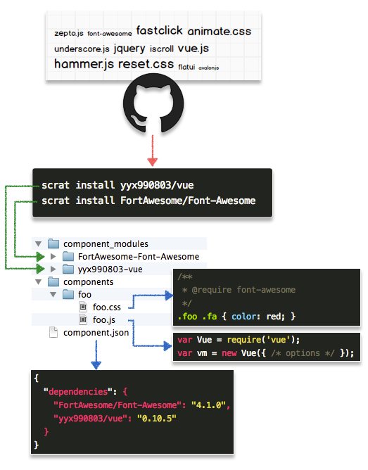

## 原理

> scrat可以从github下载符合 [component](http://github.com/component) 规范的模块，方便团队和项目间共享技术成果。



## 安装

scrat采用 [component](http://github.com/component) 作为模块生态，因此可以用scrat来安装component组件，方便开发或团队技术共享。安装生态中的模块的步骤也非常简单：

1. 先在工程目录下创建 ``component.json`` 文件。
1. 使用 ``scrat install <name>`` 命令安装需要的模块即可。


生态中的模块名称结构是 ``用户名/仓库名``，比如 [fastclick](https://github.com/ftlabs/fastclick) 这个js库，是GitHub用户 [ftlabs](https://github.com/ftlabs) 创建的，因此它的安装命令就是：

```bash
scrat install ftlabs/fastclick
```

如果需要安装特定版本的模块，可以使用 ``用户名/仓库名@版本号`` 的形式。比如想安装 [font-awesome](https://github.com/FortAwesome/Font-Awesome) 这个图标库的 ``v3.1.1`` 版本(当前是v4.1.0)，使用命令：

```bash
scrat install FortAwesome/Font-Awesome@v3.1.1
```

> 不得不吐槽，component生态下很多模块的发布方式不一致，有的模块会用 ``v1.0.0`` 来打tag，有的又没有开头的v，直接 ``1.0.0``，这使得安装生态中特定版本的模块变得比较复杂，如果安装特定版本的时候失败，可以试试加上或去掉版本号前面的v。

## 引用

每个生态组件都有一个 ``component.json`` 文件来描述模块信息，其中的 ``name`` 属性即为模块的引用id，安装好生态模块后，就可以在项目中通过引用这个id直接使用了。

如果安装的是一个js组件，就可以在 ``components`` 目录下的js模块代码中，以fastclick模块为例：

```javascript
/**
 * 文件：components/foo/foo.js
 */

var attachFastClick = require('fastclick');
attachFastClick(document.body);
```

如果是css模块，可以在工程模块的css文件中引用，通过注释中的 ``@require`` 来声明依赖，以font-awesome为例：

```css
/**
 * 文件：components/foo/foo.css
 * @require font-awesome
 */

.foo .fa {
  font-size: 30px;
}
```

> 更多模块化开发技巧请阅读 [这里](/#!/modular)

## 创建生态模块

任何人都可以自己推送生态模块，把自己做好的东西共享给小伙伴，步骤非常简单。比如我们想推送一个叫 ``foo`` 的生态模块，其步骤是：

1. 首先，需要有一个GitHub账号。
1. 在GitHub上创建一个叫 ``foo`` 的仓库，并clone到本地。

    ```bash
    git clone https://github.com/<用户名>/foo
    ```

1. clone下来的项目中创建一个 ``component.json`` 文件，以及我们的源码文件：

    ```bash
    foo
     ├─ component.json
     ├─ icon.png
     ├─ foo.tpl
     ├─ foo.css
     ├─ foo.js
     └─ README.md
    ```

1. 在 ``component.json`` 加入基本描述信息，包括名称、版本、描述、主文件、其他源码文件等。用 ``files`` 字段标记源码文件可以在安装时过滤掉一些与工程无关的文件，比如README.md

    ```json
    {
      "name": "foo",
      "version": "0.0.1",
      "description": "foo module",
      "main": "foo.js",
      "files": [
        "icon.png",
        "foo.tpl",
        "foo.css",
        "foo.js"
      ]
    }
    ```

1. 如果依赖了其他模块，可以再写入到 ``dependencies`` 字段中：

    ```json
    {
      "name": "foo",
      "version": "0.0.1",
      "description": "foo module",
      "main": "foo.js",
      "files": [
        "icon.png",
        "foo.tpl",
        "foo.css",
        "foo.js"
      ],
      "dependencies": {
        "FortAwesome/Font-Awesome": "4.1.0",
        "ftlabs/fastclick": "1.0.2"
      }
    }
    ```

    依赖模块请 ``务必`` 写准确的版本号，以保证模块本身的稳定性。

1. 编写代码，实现模块功能。编码时，资源引用都是用 ``相对路径`` 即可。
1. 将代码提交到Github：

    ```bash
    git add -A
    git commit -m "first commit"
    git push -u origin master
    ```

1. 最好给模块打一个tag，这样其他用户就可以按版本安装模块了，打tag时请 ``务必`` 保持版本号和 ``component.json`` 文件中描述的一致：

    ```bash
    git tag -a 0.0.1 -m "release v0.0.1"
    git push origin --tags
    ```

> 开发模块代码时，js中可以使用scrat内置的 ``__inline(xxx)`` 和 ``__uri(xxx)`` 来 ``内嵌`` 和 ``定位`` 资源，具体用可以阅读 [这里](/#!/todo)

## 其他

* component生态中模块发布的规范遵守情况比较差，导致很多模块安装之后不可用，有些甚至根本安装不上，所以scrat研发小组决定收集业界比较优秀的前端开发资源并放到 [scrat-team](https://github.com/scrat-team) 下维护和发布，为scrat开发体系提供高质量的生态模块。因此如果需要第三方模块，推荐优先从 [scrat-team](https://github.com/scrat-team) 下获取。
* 推荐每个团队根据自己的业务特点组织自己的模块生态，放在一个GitHub账户内维护，跨项目、跨团队共享十分方便。
* 模块生态及版本管理是一个细思恐极的问题，遇到问题可以及时 [反馈](https://github.com/scrat-team/scrat/issues) 给我们，一起建设高质量前端开发体系。