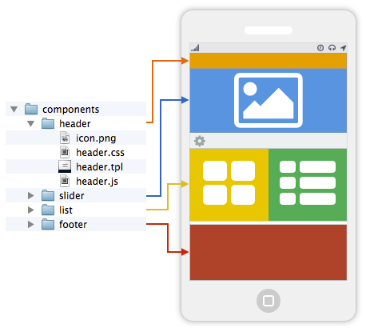
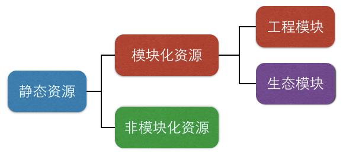
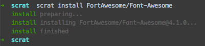

## 概念

> 工程师希望能像 ``搭积木`` 一样开发和维护系统，通过组装模块得到一个完整的系统。

在模块化系统的结构中，模块是可组合、可分解和更换的单元，这就要求模块本身具有一定的 ``独立性``，完整的前端模块化方案需要将js、css和模板维护在一起，保证模块的独立。



## 规范

在scrat中静态资源分成 ``模块化资源`` 和 ``非模块化资源`` 两类，其中模块化资源还分为 ``工程模块`` 和 ``生态模块`` 两类。



* ``模块化资源``：具有独立性的模块所对应的静态资源。每个独立的模块将自己所需要的js、css、模板、图片等资源放在一起维护，使得模块具备独立性，引用模块的js即可。
    * ``工程模块``：当前工程所开发的模块。这些模块通常跟业务耦合较高。
    * ``生态模块``：从 [模块生态](/#!/components) 下载的模块，属于外部依赖。
* ``非模块化资源``：虽然在模块化开发体系内，应该 ``一切皆模块``，但总有不应该成为模块的资源，比如入口页面、[模块化框架](/#!/framework)、页面启动器等。

其目录规范为：

```bash
project
  ├─ component_modules (生态模块)
  ├─ components        (工程模块)
  ├─ views             (非模块化资源)
  ├─ ...
```

> 如果把所有资源都扔到 ``views`` 目录下，scrat也可以退化为传统的无模块前端项目，模块化与非模块化资源之间的平衡可以由开发者自己把握。

## 开发工程模块

在模块化系统中，开发模块将变得非常简单，比如我们要开发一个 ``foo`` 模块，有模板、样式、交互功能。首先，在 ``工程模块`` 目录下创建一个foo目录，并在其中添加js、css、模板、图片等资源：

```bash
project
  ├─ component_modules (生态模块目录)
  ├─ components        (工程模块目录)
  │  └─ foo
  │     ├─ icon.png
  │     ├─ foo.css
  │     ├─ foo.tpl
  │     └─ foo.js
  ├─ views             (非模块化资源)
  ├─ ...
```

### foo.js

> 像写nodejs一样写js模块

```javascript
// 使用__inline函数嵌入其他资源，如果
// 是图片，构建后会替换为base64字符串
var tpl = __inline('foo.tpl');
// 使用__uri函数定位资源，构建后会替换
// 为部署后的绝对路径
var icon = __uri('icon.png');

//像nodejs那样导出API
exports.render = function(dom){
    dom.innerHTML = tpl;
};
exports.icon = function(img){
    img.src = icon;
};
```

### foo.tpl

> 模板会被嵌入到js中使用

```html
<div class="foo">
  <h1 class="foo-title">hello</h1>
  <p class="foo-content">
    <!--
      使用相对路径定位资源，构建后
      会被替换为部署后的绝对路径
    -->
    
    blablabla
  </p>
</div>
```

### foo.css

> css也能模块化

```css
.foo {
  font-size: 12px;
}
.foo-title {
  /* 使用相对路径引用资源 */
  background: url(icon.png) no-repeat;
  padding-left: 30px;
  font-size: 15px;
}
.foo-content {
  padding: 10px;
}
```

> 将源码中的相对路径构建后替换为部署后的绝对路径，是模块独立性的基本保证。只有将模块所需的样式、结构、逻辑都维护在一起，并且部署后还能定位到，才能保证模块独立可用。

关于工程模块的一些约定：

1. 与目录同名的js为模块主文件。即foo.js是foo模块的主文件。
1. 与js同名的css文件会自动建立依赖关系。比如foo.js自动依赖foo.css。
1. 任何文件命名没有约束，主文件的与目录同名要求只是为了引用方便而已。
1. 在代码中使用工程相对路径开发，scrat构建会后自动替换成绝对路径。

## 安装生态模块

使用生态模块可以提高开发效率，scrat采用 [component](https://github.com/component) 规范作为生态规范，因此用户可以从component生态中直接下载组件供项目使用。

从生态安装模块之前，需要先在工程中创建一个 ``component.json`` 文件，内容为空的json内容 ``{}`` 即可：

```bash
project
  ├─ component_modules (生态模块目录)
  ├─ components
  ├─ views
  ├─ component.json    (生态依赖描述)
  ├─ ...
```

component有很丰富的组件生态，比如 [FortAwesome/Font-Awesome](https://github.com/FortAwesome/Font-Awesome) 字体图标库，可以使用scrat直接从GitHub下载放到项目中使用。

在项目目录下执行：

```bash
scrat install FortAwesome/Font-Awesome
```



安装完成后，``component_modules``目录下下会出现font-awesome模块的安装文件：

```bash
project
  ├─ component_modules (生态模块目录)
  │  └─ FortAwesome-Font-Awesome
  │      └─ 4.1.0
  │         ├─ component.json
  │         ├─ css
  │         │  └─ font-awesome.css
  │         └─ fonts
  │            ├─ FontAwesome.otf
  │            ├─ fontawesome-webfont.eot
  │            ├─ fontawesome-webfont.svg
  │            ├─ fontawesome-webfont.ttf
  │            └─ fontawesome-webfont.woff
  ├─ components
  ├─ views
  ├─ component.json    (生态依赖描述)
  ├─ ...
```

``component.json``文件也记录了安装的模块名及其版本：

```json
{
  "dependencies": {
    "FortAwesome/Font-Awesome": "4.1.0"
  }
}
```

这样，一个来自生态的模块就可以在项目中直接使用了。

> 有关模块生态的更多内容请阅读 [这里](/#!/components)。

## 引用模块

开发或安装好一个模块之后，需要做的仅仅就是使用它们。由于资源分为模块化和非模块化两类，因此在不同的资源下引用模块是有所不同的。

### 在模块化js中引用模块

> 如nodejs般使用require函数就可以了

```javascript
// 引用其他模块
var foo = require('foo');
// 引用当前目录下的文件
var conf = require('./conf.js');
// 调用模块接口
foo.render(document.body);
```

### 在模块化css中引用模块

> 使用注释中的@require xxx来标记依赖

```css
/**
 * 引用模块
 * @require font-awesome
 *
 * 引用文件
 * @require ./bar.css
 */

.foo .fa {
    font-size: 20px;
}
```

### 在非模块化文件中使用模块

非模块化文件通过 [模块化框架](/#!/framework) 来异步加载需要的模块，比如项目的主页面：

```html
...
<script src="path/to/scrat.js"></script>
<script>
  // 构建后会将__FRAMEWORK_CONFIG__变量
  // 替换成框架配置，比如依赖关系、模块别名等
  require.config(__FRAMEWORK_CONFIG__);
  // scrat会将模块所依赖的资源都加载完成后
  // 再执行回调函数
  require.async(['foo', 'font-awesome'], function(foo){
      foo.render(document.body);
  });
</script>
...
```

> 模块化框架的具体工作原理请阅读 [这里](/#!/framework?title=工作原理)。

## 开发技巧

### 1. 设置别名

模块的主文件有一个默认的别名，比如文件 ``components/foo/foo.js`` 的别名是 ``foo``，这样可以通过 ``require('foo')`` 来引用它，但模块内的其他文件就没有这样的待遇，主要考虑是非主文件通常是在模块内通过文件路径引用的，比如 components/foo/bar.js，没有别名，它通常是被foo模块的主文件使用的，因此在foo.js中用 ``require('./bar.js')`` 引用即可，其他模块要使用它也可以通过相对路径来引用，但书写起来略麻烦，如果希望它也能有一个别名，也可以在scrat工具配置文件 ``fis-conf.js`` 中设置：

```javascript
fis.config.set('framework.alias.foo-bar', 'components/foo/bar.js');
```

这样就可以在其他模块化文件中通过 ``require('foo-bar')`` 来直接引用了。

> 更多框架配置请阅读 [这里](/#!/settings?title=framework)

### 2. 工程模块支持多级目录

多级目录可以帮助业务合理的规划模块拆分，比如scrat与 [vue.js](http://vuejs.org/) 结合的时候，可以按照vue的概念来划分模块：

```bash
project
  ├─ components    (工程模块)
  │  ├─ directive  (directive)
  │  │  └─ more
  │  ├─ filter     (filter)
  │  │  └─ data
  │  ├─ component  (组件)
  │  │  ├─ header
  │  │  └─ footer
  │  └─ page       (页面)
  │     ├─ index
  │     └─ detail
  ├─ ...
```

模块和id别名的对应关系如下：

|工程文件|别名|
|-------|----|
|components/foo/foo.js|foo|
|components/foo/bar.js|无|
|components/foo/bar/bar.js|foo/bar|
|components/foo/bar/foo.js|无|
|components/foo/foo/foo.js|foo/foo|
