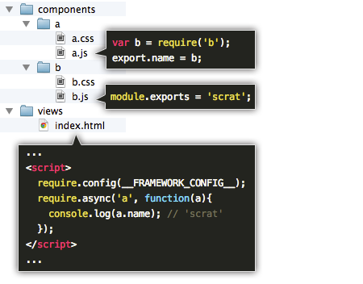
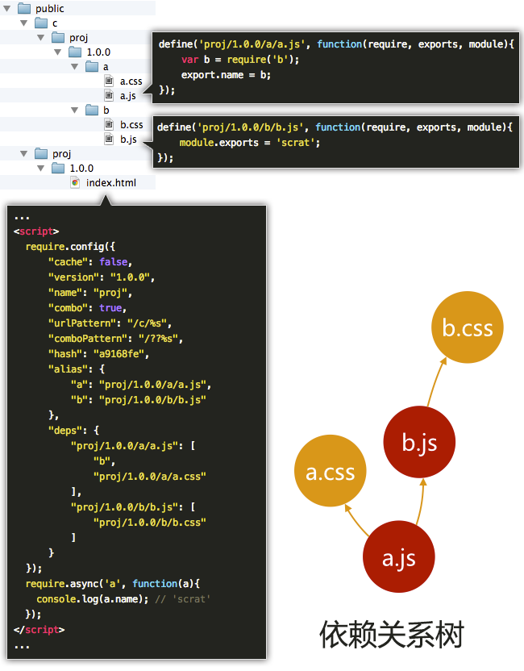

## fis-conf.js

scrat是基于 [fis](http://fis.baidu.com) 打造的前端集成解决方案，其配置风格也遵循fis的设计规范，项目根目录下的 ``fis-conf.js`` 文件即为工具配置文件。

```bash
project
  ├─ component_modules (生态组件目录)
  ├─ components        (模块化资源目录)
  ├─ views             (非模块化资源目录)
  └─ fis-conf.js       (构建工具配置文件)
```

## name

> 项目名（必须设置）

* 类型：``string``
* 解释：每个scrat项目需要指定一个项目名，构建时会将项目名作为发布路径中的一部分，这样可以在一台机器上部署多个项目的构建结果。
* 示例：
```javascript
fis.config.set('name', 'my_proj');
```

## version

> 项目版本（必须设置）

* 类型：``string``
* 解释：每个scrat项目需要指定一个项目版本，构建时会将项目版本作为发布路径的一部分，这样可以在一个项目下部署多个版本的构建结果。
* 示例：
```javascript
fis.config.set('version', '1.0.1');
```

## framework

> [前端框架](/!#/todo) 相关的构建配置

scrat的模块化开发方案采用前端框架与构建工具结合的方式实现静态资源管理与性能优化等方案。配置中的framework节点下的各种数据将传递给前端框架作为运行时框架配置。



源码中使用 ``__FRAMEWORK_CONFIG__`` 占位，scrat构建后会将其替换为framework配置节点的数据，得到框架运行配置，从而实现前端模块化管理的相关功能：



有关前端框架与工具配合的工作原理介绍请阅读 [这里](/#!/framework?title=工作原理)

### framework.cache

* 类型：``boolean``
* 解释：设置前端框架是否开启静态资源本地缓存。设置该配置为 ``true``，并且在scrat构建时加 ``--optimize`` 或 ``-o`` 参数才会生效。
* 示例：
fis-conf.js配置
```javascript
fis.config.set('framework.cache', true);
```
构建命令
```bash
scrat release -o
```
源码
```javascript
require.config(__FRAMEWORK_CONFIG__);
```
构建后
```javascript
require.config({ cache: true });
```

### framework.combo

* 类型：``boolean``
* 解释：设置前端框架是否开启静态资源combo合并。在scrat构建时加 ``--pack`` 或 ``-p`` 参数即可生效。
* 示例：
构建命令
```bash
scrat release -p
```
源码
```javascript
require.config(__FRAMEWORK_CONFIG__);
```
构建后
```javascript
require.config({ combo: true });
```

### framework.comboPattern

* 类型：``string``
* 解释：指定combo的url格式，默认是 ``/??%s``，要开启combo才有效。
* 示例：
fis-conf.js配置
```javascript
fis.config.set('framework.combo', true);
fis.config.set('framework.comboPattern', '/combo??%s');
```
构建命令
```bash
scrat release -p
```
源码
```javascript
require.config(__FRAMEWORK_CONFIG__);
```
构建后
```javascript
require.config({
    combo: true,
    comboPattern: '/combo??%s'
});
```
通过combo服务请求模块化资源时，url格式为：
http://example.com/combo??a.js,b.js

### framework.urlPattern

* 类型：``string``
* 解释：请求模块化静态资源时的url格式，默认是 ``/c/%s``。
* 示例：
fis-conf.js配置
```javascript
fis.config.set('framework.urlPattern', '/public/c/%s');
```
构建命令
```bash
scrat release
```
源码
```javascript
require.config(__FRAMEWORK_CONFIG__);
```
构建后
```javascript
require.config({
    urlPattern: '/public/c/%s'
});
```
通过combo服务请求模块化资源时，url格式为：
http://example.com/public/c/a.js

### framework.alias

* 类型：``object``
* 解释：自定义别名。有些模块化资源不具有默认别名时，可以通过次配置指定，key是别名，value是文件的工程路径。
* 示例：
fis-conf.js配置
```javascript
fis.config.set('framework.alias', {
    'bar' : 'components/foo/bar.js',
    '$$' : 'components/foo/a.js'
});
/* 或者：
   fis.config.set('framework.alias.bar', 'components/foo/bar.js');
   fis.config.set('framework.alias.$$', 'components/foo/a.js');
 */
```
源码中引用：
```javascript
var bar = require('bar');
var $$ = require('$$');
```

## settings

> 构建工具插件运行配置

scrat使用的插件大都是对原插件的包装调用，代码非常简单，但有时需要对插件进行配置，因此settings节点可以把相应配置传给插件在运行时读取使用，以下列举scrat内置的插件及其配置方式。

### settings.parser.marked

> 将 ``md`` 后缀的文件解析为html内容。

* 插件名称：[fis-parser-marked](https://github.com/fouber/fis-parser-marked)
* 插件来源：[marked](https://github.com/chjj/marked)
* 配置文档：https://github.com/chjj/marked#options-1
* 注意事项：在scrat中，md文件默认不会发布出来，通常是在js、html等文件中嵌入使用的。
* 使用示例：
fis-conf.js配置
```javascript
fis.config.set('settings.parser.marked', {
    gfm: true,
    tables: true,
    breaks: false
});
```
某md文件：
```markdown
# hello world
```
在js文件中使用 ``__inline(path)`` 函数嵌入资源：
```javascript
var html = __inline('foo.md');
```
该js文件构建后：
```javascript
var html = '<h1>hello world</h1>';
```
在html文件中使用 ``link`` 标签加 ``?__inline`` 标记嵌入资源：
```html
...
<link rel="import" href="foo.md?__inline"/>
...
```
该html文件构建后：
```html
...
<h1>hello world</h1>
...
```

### settings.parser.stylus

> 将 ``styl`` 后缀的文件解析为css内容。

* 插件名称：[scrat-parser-stylus](https://github.com/fouber/scrat-parser-stylus)
* 插件来源：[stylus](https://github.com/LearnBoost/stylus)
* 配置文档：无需配置
* 使用示例：
某styl文件
```bash
fonts = helvetica, arial, sans-serif
border-radius()
    -webkit-border-radius arguments
    -moz-border-radius arguments
    border-radius arguments
body
    padding 50px;
    font 14px/1.4 fonts;
a.button
    border-radius(5px)
```
构建后：
```css
body {
    padding: 50px;
    font: 14px/1.4 helvetica, arial, sans-serif;
}
a.button {
    -webkit-border-radius: 5px;
    -moz-border-radius: 5px;
    border-radius: 5px;
}
```

### settings.parser.handlebars

> 将 ``handlebars`` 后缀的文件预编译为 [handlebars](http://handlebarsjs.com/) 运行时模板

### settings.optimizer.uglify-js

> 调用 [uglify-js](/#!/todo) 压缩js文件

### settings.optimizer.clean-css

> 调用 [clean-css](/#!/todo) 压缩css、styl文件

### settings.optimizer.html-minifier

> 调用 [html-minifier](/#!/todo) 压缩tpl、md文件

### settings.lint.jshint

> 调用 [jshint](/#!/todo) 校验js代码

### settings.spriter.csssprites

> css雪碧图处理配置
